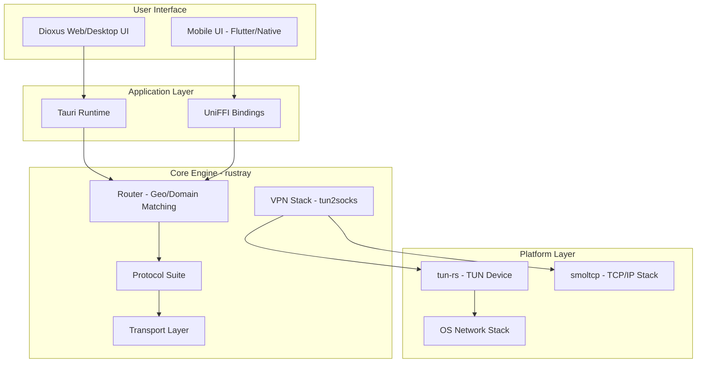
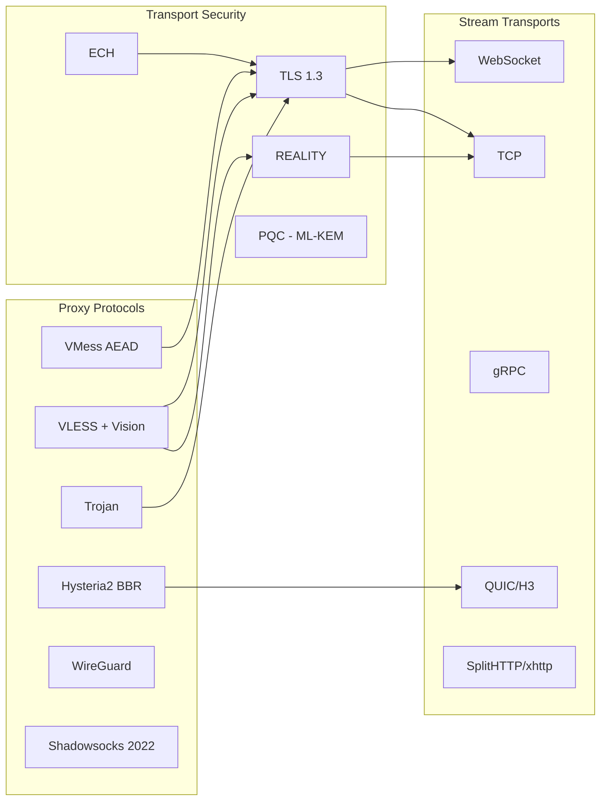
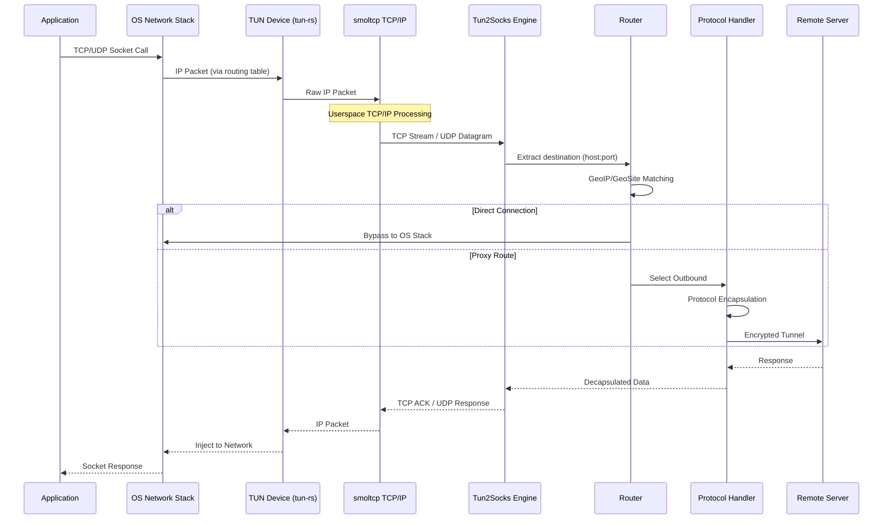
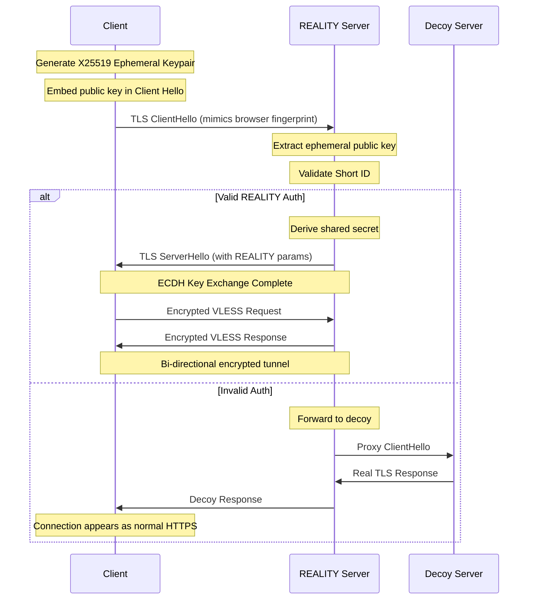
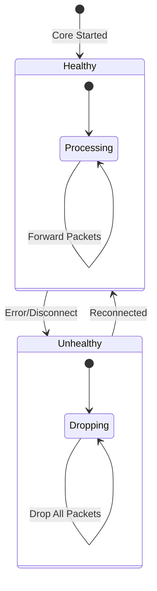

# EdgeRay Architecture

> High-Performance Cross-Platform VPN Client with Rust Core

## Overview

EdgeRay is a modern VPN client implementing multiple proxy protocols with a focus on performance, security, and cross-platform compatibility. The architecture follows a layered design with a pure-Rust core that abstracts platform-specific concerns.

## System Context



## Core Components

### rustray (Rust Core Library)

The core library provides all proxy functionality in pure Rust:

| Component | Location | Purpose |
|-----------|----------|---------|
| Protocols | `src/protocols/` | VMess, VLESS, Trojan, Hysteria2, WireGuard, Shadowsocks |
| Transport | `src/transport/` | TLS, REALITY, ECH, WebSocket, gRPC, QUIC, SplitHTTP |
| Router | `src/router.rs` | GeoIP/GeoSite matching, domain-based routing |
| VPN Stack | `src/tun/` | tun-rs device, smoltcp TCP/IP stack, Tun2Socks engine |
| API | `src/api/` | gRPC service for control plane |

### Protocol Suite



## Packet Lifecycle

The complete path of a packet through the VPN stack:



## VLESS REALITY Handshake

Detailed handshake sequence for VLESS with REALITY transport:



## MTU Profiles

The VPN stack supports multiple MTU profiles for different network environments:

| Profile | MTU | MSS (IPv4) | MSS (IPv6) | Use Case |
|---------|-----|------------|------------|----------|
| Cellular | 1400 | 1360 | 1340 | Mobile networks with overhead |
| Standard | 1500 | 1460 | 1440 | Normal ethernet |
| Jumbo | 9000 | 8960 | 8940 | High-performance LAN/DC |

### MSS Clamping

TCP MSS is dynamically clamped in SYN packets to prevent fragmentation:

```
MSS = MTU - IP_Header - TCP_Header
IPv4: MSS = MTU - 20 - 20
IPv6: MSS = MTU - 40 - 20
```

## Kill-Switch Implementation

Zero-leak protection is implemented via atomic flag:



When `CORE_HEALTHY` is `false`:

- All outgoing packets are silently dropped
- No traffic leaks to the direct network
- System routes remain in place
- Reconnection attempts continue

## Cross-Platform Support

| Platform | UI Framework | Core Binding | TUN Implementation |
|----------|--------------|--------------|-------------------|
| Linux | Dioxus (Tauri) | Native | tun-rs |
| macOS | Dioxus (Tauri) | Native | tun-rs (utun) |
| Windows | Dioxus (Tauri) | Native | tun-rs (Wintun) |
| Android | Kotlin/Compose | UniFFI | VpnService + tun |
| iOS | Swift/SwiftUI | UniFFI | NetworkExtension |

## Directory Structure

```
edgeray-workspace/
├── rustray/                    # Core Rust library
│   ├── src/
│   │   ├── protocols/          # VMess, VLESS, Trojan, etc.
│   │   ├── transport/          # TLS, REALITY, WebSocket, etc.
│   │   ├── tun/                # TUN device and Tun2Socks
│   │   ├── router.rs           # Routing engine
│   │   └── api/                # gRPC control plane
│   └── benches/                # Performance benchmarks
├── edgeray-app/                # Desktop/Web UI (Dioxus + Tauri)
│   ├── src/                    # Frontend components
│   └── src-tauri/              # Tauri backend
├── shared-types/               # Shared type definitions
│   └── src/
│       ├── lib.rs              # Protocol, ServerConfig
│       └── parser.rs           # Link parsing/generation
└── docs/
    └── adr/                    # Architecture Decision Records
```

## Performance Characteristics

| Metric | Target | Implementation |
|--------|--------|----------------|
| Packet Latency | < 0.5ms | Lock-free queues (crossbeam) |
| Memory Allocation | Zero-copy | `bytes` crate, buffer pools |
| Crypto | Hardware-accelerated | AES-NI, ARM NEON via ring |
| Binary Size | < 15MB (mobile) | LTO, symbol stripping |

## Security Model

1. **Memory Safety**: Pure Rust core, no unsafe outside FFI boundaries
2. **Traffic Obfuscation**: REALITY, ECH, TLS fingerprinting
3. **Kill-Switch**: Atomic flag prevents leak during disconnect
4. **Replay Protection**: Per-protocol LRU nonce caches
5. **Post-Quantum Ready**: ML-KEM-768 hybrid key exchange support
