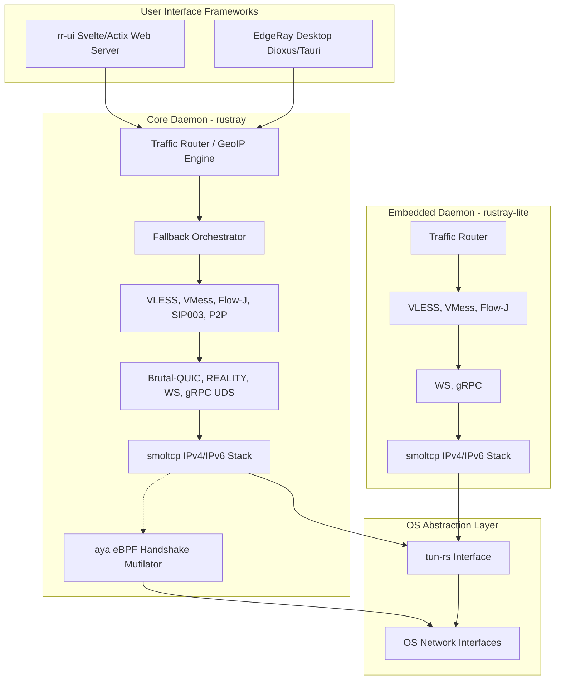
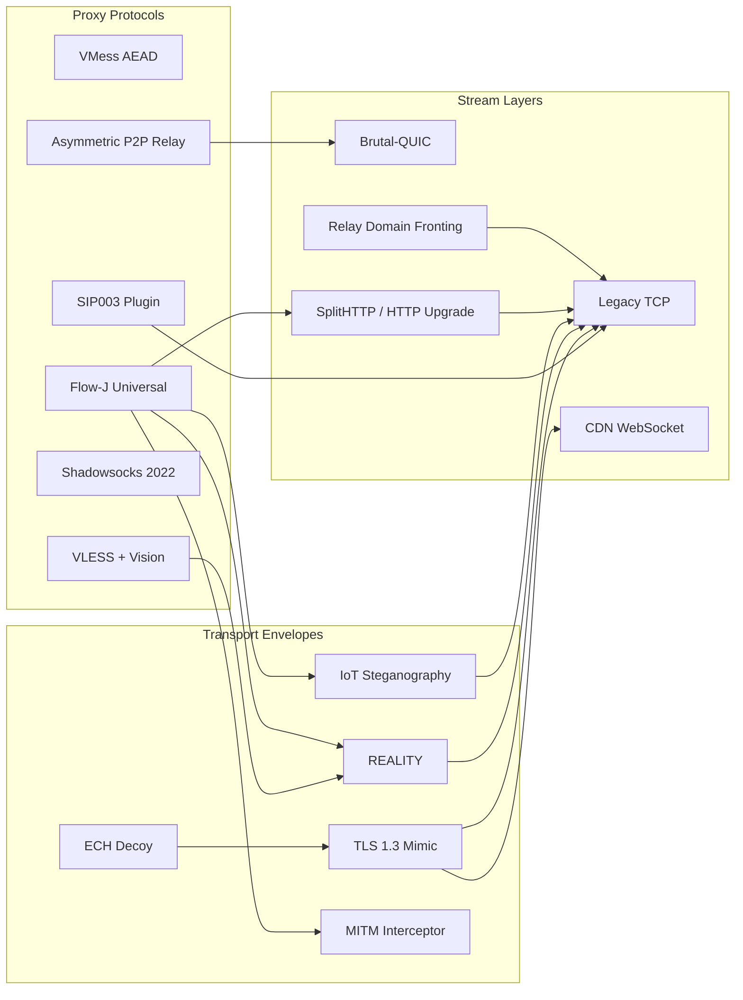

# EdgeRay Architecture

> High-Performance Cross-Platform VPN Client with Rust Core

**Status:** The Phase 7 Evasion & Transport Orchestration Architecture is **100% Finalized** and compile-safe.

## Overview

EdgeRay is a modern VPN ecosystem implementing the most advanced anti-censorship protocols with a focus on extreme performance, resilience (via FEC and multipathing), and cross-platform compatibility. The system is split cleanly between the headless `rustray` engine, the `edgeray-app` desktop client, `rr-ui` server/management panel and `rustray-lite` for embedded systems.

## System Context

## Core Components

### rustray (Rust Core Library)

The core library provides zero-allocation payload forwarding using `tokio` and `bytes` in pure Rust:

| Component | Location | Purpose |
|-----------|----------|---------|
| Protocols | `src/protocols/` | VMess, VLESS, Trojan, Flow-J, Shadowsocks, SIP003 |
| Transport | `src/transport/` | Brutal-QUIC, REALITY, P2P Relay BLAKE3, RelayFronting, WebSocket, gRPC, ECH |
| Orchestrator | `src/orchestrator/` | Active probe failure detection and path hot-swapping |
| Router | `src/router.rs` | GeoIP/GeoSite matching, domain-based routing |
| VPN Stack | `src/tun/` | tun-rs device, smoltcp userspace TCP/IP stack with legacy mimicry |
| Traffic Shaping | `src/transport/behavior_synth.rs` | Markov-chain protocol mimicry (Modbus, MQTT, HTTPS) |
| MITM Core | `src/transport/mitm.rs` | Transparent TLS termination and on-the-fly certificate generation |
| Kernel Hooks | `src/ebpf/` | aya-based map loaders for TLS ClientHello packet slicing |
| API | `src/api/` | Self-healing UDS manager for local metrics aggregation |

### edgeray-app (Desktop Client)
The `edgeray-app` crate is the consumer-facing Graphical User Interface (GUI) and desktop systems integration for the EdgeRay ecosystem. It unites the extreme speed of the `rustray` network daemon with a highly optimized, universally portable window manager.

### rr-ui (Web UI)
Web-based panel and data models for managing EdgeRay and Xray-compatible cores on remote servers.

### rustray-lite (Embedded)
A lightweight version of the `rustray` core, designed for embedded systems with limited resources.

### Protocol & Transport Suite

## MTU Profiles & Elastic FEC

EdgeRay features full support for MTU optimization and uses Reed-Solomon per-stream Forward Error Correction (FEC).

| Profile | MTU | Parity Shards (FEC) | Use Case |
|---------|-----|----------------------|----------|
| Cellular | 1400 | Data: 10, Parity: 5 | Extremely lossy 3G/LTE towers |
| Standard | 1500 | Data: 10, Parity: 2 | Standard Broadband |
| Jumbo | 9000 | Data: 10, Parity: 0 | Perfect line Gigabit Datacenters |

## The Fallback Orchestrator

The Orchestrator actively probes the active protocol (like `Flow-J`). If the health checker detects persistent threshold timeouts (indicating BGP throttling or DPI blocking):

1. Connections instantly lock.
2. The core shifts to the next array tag (e.g., `backup-p2p`).
3. Connection resumes seamlessly with the new encapsulation.
4. Old sessions are gracefully culled.

## Cross-Platform Availability

| Platform | UI Framework | Core Binding | Kernel Execution |
|----------|--------------|--------------|-------------------|
| Linux | Dioxus (Tauri) | Native | aya / eBPF / tun-rs |
| macOS | Dioxus (Tauri) | Native | tun-rs (utun) |
| Windows | Dioxus (Tauri) | Native | tun-rs (Wintun) |
| Android | Kotlin | UniFFI | VpnService + tun |
| iOS | Swift | UniFFI | NetworkExtension |
| Embedded | N/A | Native | tun-rs |

## Memory Integrity & Performance

| Metric | Target | Implementation |
|--------|--------|----------------|
| Packet Latency | < 0.2ms | Lock-free queues (crossbeam), kernel splice() |
| Memory Handling | Zero-copy | `bytes` crate, single-pass buffers |
| Security | Quantum-Ready | ML-KEM-768 hybrid key exchange support |
| Payload Resiliency| Invisible | Reed-Solomon mathematical matrix parity |
